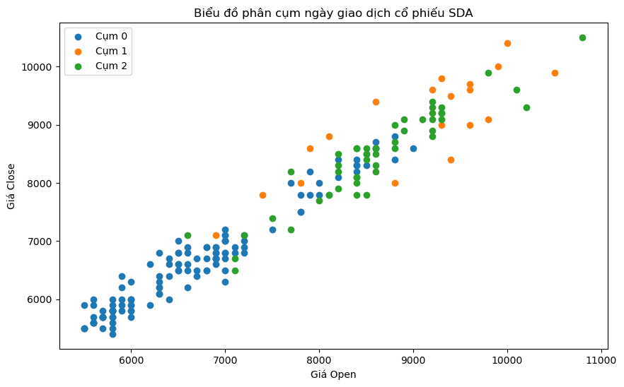

# 📈 Stock Market Pattern Analysis & Clustering

## Project Overview (Tổng quan)
Dự án này áp dụng các kỹ thuật **Khai phá dữ liệu (Data Mining)** và **Học máy (Machine Learning)** để phân tích hành vi của thị trường chứng khoán. 

Mục tiêu là sử dụng thuật toán **K-Means Clustering** để phân nhóm các ngày giao dịch có đặc điểm tương đồng dựa trên các chỉ số OHLCV (Open, High, Low, Close, Volume), từ đó nhận diện các mẫu hình biến động giá (Pattern Recognition) để hỗ trợ ra quyết định đầu tư.

## Tech Stack & Skills
* **Language:** Python.
* **Data Analysis:** Pandas, NumPy.
* **Machine Learning:** Scikit-learn (K-Means Clustering).
* **Visualization:** Matplotlib.

## Implementation Details (Quy trình thực hiện)
1.  **Data Processing:** Làm sạch và chuẩn hóa dữ liệu giao dịch chứng khoán.
2.  **Feature Engineering:** Lựa chọn các đặc trưng quan trọng (Giá mở cửa, đóng cửa, khối lượng...).
3.  **Clustering Modeling:**
    * Sử dụng thuật toán K-Means để phân loại thị trường thành 3 nhóm hành vi (Clusters).
    * Xác định tâm cụm (Cluster Centers) để hiểu đặc tính của từng nhóm.
4.  **Visualization:** Trực quan hóa kết quả phân cụm để thấy rõ sự phân tách giữa các xu hướng.

## Key Findings (Kết quả phân tích)
Mô hình đã phân tách dữ liệu thành 3 cụm hành vi đặc trưng (Ví dụ):
* **Cluster 0:** Biến động thấp, khối lượng giao dịch trung bình (Giai đoạn tích lũy).
* **Cluster 1:** Giá tăng mạnh kèm khối lượng lớn (Xu hướng Bullish).
* **Cluster 2:** Biến động giá mạnh nhưng khối lượng thấp (Giai đoạn rủi ro/điều chỉnh).

## 👥 Contributors
* Tran Thi Truc Xinh
* Dao Viet Anh
* Nguyen Thi Nha Phuong
## 📬 Contact
* **Author:** Tran Thi Truc Xinh
* **LinkedIn:** www.linkedin.com/in/tran-thi-truc-xinh-972072279
