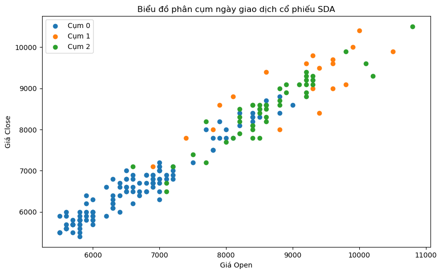

# 📈 Stock Market Pattern Analysis & Clustering

## Project Overview
This project applies **Data Mining** and **Machine Learning** techniques to analyze stock market behavior.

The goal is to use **K-Means Clustering** to group trading days with similar characteristics based on OHLCV (Open, High, Low, Close, Volume) data. This enables **pattern recognition** in price movements to support investment decision-making.

## Tech Stack & Skills
* **Language:** Python  
* **Data Analysis:** Pandas, NumPy  
* **Machine Learning:** Scikit-learn (K-Means Clustering)  
* **Visualization:** Matplotlib  

## Implementation Details
1. **Data Processing:** Clean and standardize stock market trading data.  
2. **Feature Engineering:** Select key features (Open, Close, High, Low prices, Volume, etc.).  
3. **Clustering Modeling:**  
    * Apply K-Means algorithm to classify the market into 3 behavioral clusters.  
    * Determine cluster centers to understand the characteristics of each group.  
4. **Visualization:** Visualize clustering results to clearly see the separation between trends.  

## Key Findings
The model identified 3 distinct behavioral clusters (for example):  
* **Cluster 0:** Low volatility, average trading volume (Accumulation phase)  
* **Cluster 1:** Strong price increase with high volume (Bullish trend)  
* **Cluster 2:** High price volatility but low volume (Risk/Correction phase)  

## 👥 Contributors
* Tran Thi Truc Xinh  
* Dao Viet Anh  
* Nguyen Thi Nha Phuong  

## 📬 Contact
* **Author:** Tran Thi Truc Xinh  
* **LinkedIn:** https://www.linkedin.com/in/tranthitrucxinh/
